<div align="center">


# K-O11y OTel Gateway

**엔터프라이즈 배포용 JWT 기반 라이선스 검증이 탑재된 OpenTelemetry Collector 배포판.**

[English](README.md) | [한국어](README.ko.md)

[](https://www.repostatus.org/#wip)
[](LICENSE)
[](https://go.dev/)

[OpenTelemetry Collector v0.109.0](https://github.com/open-telemetry/opentelemetry-collector) 기반입니다.

</div>

---

## ✨ 주요 기능

- 🛂 **License Guard Extension** — RS256 JWT 기반 라이선스 검증 (공개키만 사용 — 비공개키 불필요)
- 🚪 **License Gate Processor** — 라이선스 만료 + 유예 기간 종료 시 원격측정 데이터(traces/logs/metrics) 드롭
- ⏳ **유예 기간(Grace Period)** — 설정 가능한 유예 윈도우 (기본 7일) — 만료 직후 즉시 차단하지 않고 운영자에게 경고
- 🔁 **주기적 재검증** — 설정 가능한 주기로 라이선스 상태 재확인 (기본 1시간)
- 📊 **Prometheus 메트릭** — 라이선스 상태 및 드롭 현황 4종 내장
- 🔧 **Pass-through 모드** — 라이선스 미설정 시 투명 통과 (개발/테스트 환경용)
- 🏢 **멀티테넌트 지원** — 라이선스 claims(`tenant_id`, `contract_id`)를 메트릭 속성으로 노출
- 📦 **업스트림 호환** — 전체 OTel Collector 기능(ClickHouse Exporter, span metrics processor 등) 그대로 유지

---

## 🏗️ 동작 방식

Gateway는 Host 클러스터 최전단, ClickHouse 앞단에 위치합니다. Agent 클러스터에서 들어오는 모든 OTLP 페이로드는 2단계 라이선스 검사를 거칩니다. **License Guard Extension** 이 현재 라이선스 상태를 유지·갱신하고, **License Gate Processor** 가 각 배치마다 그 상태를 확인해 ClickHouse로 전달하거나 드롭 카운터를 증가시키며 폐기합니다.

```mermaid
flowchart LR
    subgraph Agents["Agent 클러스터"]
        A1[OTel Collector<br/>DaemonSet]
        A2[OTel Collector<br/>Deployment]
    end

    subgraph Gateway["K-O11y OTel Gateway"]
        direction TB
        R[OTLP Receiver<br/>:4317]
        LG["🛂 License Guard Extension<br/>(RS256 JWT 검증,<br/>check_interval: 1h)"]
        GP["🚪 License Gate Processor<br/>(Guard 상태 확인)"]
        B[Batch Processor]
        E[ClickHouse Exporter]

        R --> GP
        GP --> B
        B --> E
        LG -.상태.-> GP
    end

    subgraph Decision["Gate 판정"]
        direction TB
        V{라이선스<br/>유효?}
        G{유예 기간<br/>내?}
        PASS[✅ ClickHouse로 전달]
        WARN[⚠️ 전달 + 경고 로그]
        DROP["❌ 드롭<br/>otel_data_dropped_total++"]

        V -->|yes| PASS
        V -->|no| G
        G -->|yes| WARN
        G -->|no| DROP
    end

    A1 -->|OTLP gRPC| R
    A2 -->|OTLP gRPC| R
    GP -.배치마다.-> V

    E --> CH[(ClickHouse)]

    classDef agent fill:#e1f5ff,stroke:#0288d1,color:#000
    classDef gw fill:#fff3e0,stroke:#f57c00,color:#000
    classDef decide fill:#f3e5f5,stroke:#7b1fa2,color:#000
    class A1,A2 agent
    class R,LG,GP,B,E gw
    class V,G,PASS,WARN,DROP decide
```



**검증 흐름**:

1. 시작 시 License Guard가 환경변수(`LICENSE_KEY`)에서 JWT를 로드하고 설정된 공개키로 RS256 서명을 검증
2. Guard가 claims(`tenant_id`, `contract_id`, `exp`)를 추출해 Prometheus 메트릭에 기록
3. 매 `check_interval`(기본 1시간)마다 Guard가 재검증하고 인메모리 상태 갱신
4. 모든 원격측정 배치에 대해 License Gate Processor가 Guard 상태를 확인:
   - **유효** → 다음 프로세서로 전달
   - **만료 + 유예 기간 내** → 전달 + 경고 로그
   - **만료 + 유예 기간 종료** → 드롭 및 `otel_data_dropped_total` 증가

---

## 🧩 커스텀 컴포넌트

### License Guard Extension

JWT 기반 라이선스 검증 확장으로, 라이선스 상태를 Prometheus 메트릭과 OpenTelemetry 내부 메트릭으로 노출합니다.

- **RS256 공개키 검증** — Gateway에는 공개키만 배포되며, 비공개키는 라이선스 발급자 측에만 존재
- **만료 추적** + 설정 가능한 유예 기간
- **정기 재검증** (기본: `1h`)
- **Pass-through 모드** — 라이선스 미설정 시 투명 통과 (개발/테스트용)
- **`fail_mode`** — `closed`(검증 실패 시 차단) 또는 `open`(허용)

### License Gate Processor

License Guard가 유예 기간을 넘긴 만료 상태를 보고하면 원격측정 데이터를 드롭하는 프로세서입니다.

- **traces, logs, metrics** 파이프라인 모두 지원
- License Guard Extension과 이름(`extension_name`)으로 연동
- **유예 기간 중**: 경고만 기록하고 데이터 통과
- **유예 기간 종료 후**: 데이터 드롭 + `otel_data_dropped_total` 증가

---

## ⚙️ 설정

### License Guard Extension

```yaml
extensions:
  license_guard:
    # JWT 라이선스 키 (환경변수 참조)
    license_key_env: "LICENSE_KEY"

    # JWT 검증용 RSA 공개키 (PEM 형식)
    public_key_pem: |
      -----BEGIN PUBLIC KEY-----
      ...
      -----END PUBLIC KEY-----

    # 재검증 주기 (기본: 1h)
    check_interval: 1h

    # 만료 후 유예 기간 (기본: 7일)
    grace_period_days: 7

    # 검증 실패 시 동작: "closed" (차단) 또는 "open" (허용)
    fail_mode: closed
```

### License Gate Processor

```yaml
processors:
  license_gate:
    # 참조할 License Guard 확장 이름 (기본: "license_guard")
    extension_name: license_guard
```

### 파이프라인 예시

```yaml
extensions:
  license_guard:
    license_key_env: "LICENSE_KEY"
    public_key_pem: |
      -----BEGIN PUBLIC KEY-----
      ...
      -----END PUBLIC KEY-----

service:
  extensions: [license_guard]
  pipelines:
    traces:
      receivers: [otlp]
      processors: [license_gate, batch]
      exporters: [clickhouse]
    logs:
      receivers: [otlp]
      processors: [license_gate, batch]
      exporters: [clickhouse]
    metrics:
      receivers: [otlp]
      processors: [license_gate, batch]
      exporters: [clickhouse]
```

---

## 🛠️ 빌드

### 필수 조건

- Go 1.22+
- Docker

### 바이너리 빌드

```bash
go build -o signoz-otel-collector ./cmd/signozotelcollector
```

### Docker 이미지 빌드

```bash
docker build -t ghcr.io/wondermove-inc/signoz-otel-collector:latest \
  -f cmd/signozotelcollector/Dockerfile .
```

### 테스트 실행

```bash
go test ./extension/licenseguardextension/...
go test ./processor/licensegateprocessor/...
```

---

## 📊 Prometheus 메트릭

| 메트릭 | 타입 | 설명 | 속성 |
|--------|------|------|------|
| `otel_license_valid` | Gauge | 라이선스 유효 여부 (`1`=유효, `0`=무효) | `tenant_id`, `contract_id` |
| `otel_license_expires_in_days` | Gauge | 라이선스 만료까지 남은 일수 (음수 = 만료됨) | `tenant_id`, `contract_id` |
| `otel_grace_period_remaining_days` | Gauge | 유예 기간 잔여 일수 (유예 기간이 아니면 `0`) | `tenant_id`, `contract_id` |
| `otel_data_dropped_total` | Counter | 라이선스 만료로 드롭된 데이터 포인트 누적 | `reason=license_expired`, `signal=traces\|logs\|metrics` |

**알림 룰 예시**:

```yaml
# 라이선스가 14일 이내 만료
- alert: LicenseExpiringSoon
  expr: otel_license_expires_in_days < 14
  for: 10m

# 라이선스 만료로 데이터가 드롭되고 있음
- alert: DataDroppedLicenseExpired
  expr: rate(otel_data_dropped_total[5m]) > 0
  for: 1m
```

---

## 🐛 트러블슈팅

| 증상 | 예상 원인 | 해결 |
|------|----------|------|
| 시작 시 `license_guard: failed to verify JWT` | 공개키 PEM 불일치 또는 `LICENSE_KEY` 환경변수 오류 | `public_key_pem`이 발급자의 키 쌍과 일치하는지 확인; `LICENSE_KEY` 값 재확인 |
| 새 라이선스인데 `otel_license_valid = 0` | Gateway 호스트의 시계 편차 | Gateway 노드에 NTP 설정 확인 |
| `otel_data_dropped_total`이 예상치 못하게 증가 | 라이선스 만료 + 유예 기간 종료 | 라이선스 키(`LICENSE_KEY` 환경변수) 갱신 후 재시작하거나, 임시로 `grace_period_days` 증가 |
| Gateway는 뜨지만 ClickHouse에 데이터가 도달하지 않음 | `license_gate` 프로세서 순서 문제 | 모든 파이프라인에서 `license_gate`가 `batch`보다 앞에 오는지 확인 |
| 개발 환경이 라이선스로 차단됨 | 프로덕션 설정이 개발에 적용됨 | 개발 환경에서는 `license_guard` 확장 자체를 생략 (pass-through 모드) |

---

## 🤝 기여하기

K-O11y OTel Gateway는 [K-O11y](https://github.com/Wondermove-Inc/k-o11y) 프로젝트의 일부입니다.

1. **이슈 찾기** — `good first issue` 또는 `help wanted` 라벨 확인
2. **이슈에 댓글** — 작업 의사를 밝혀 중복 작업을 피합니다
3. **Fork → branch → PR** — 범위는 좁게, 설명은 명확하게
4. **리뷰 반영** — 메인테이너가 수 일 이내 답변합니다

자세한 내용은 [CONTRIBUTING.md](CONTRIBUTING.md)를 참고하세요.

본 프로젝트는 **passive maintenance** 모델입니다 — PR과 이슈는 시간이 허락하는 대로 검토됩니다. 7일 내 응답을 목표로 하지만 보장하지는 않습니다.

---

## 📄 라이선스

Apache License 2.0 — [LICENSE](LICENSE) 참조.

[SigNoz OTel Collector](https://github.com/SigNoz/signoz-otel-collector) (Apache 2.0) 포크이며, [OpenTelemetry Collector](https://github.com/open-telemetry/opentelemetry-collector) (Apache 2.0) 기반입니다. 상세 출처는 [NOTICE](NOTICE) 파일을 참고하세요.

---

## 🔗 관련 프로젝트

- **Umbrella**: [k-o11y](https://github.com/Wondermove-Inc/k-o11y) — 전체 스택 개요가 담긴 메타 레포
- **Server**: [k-o11y-server](https://github.com/Wondermove-Inc/k-o11y-server) — 관측성 백엔드 + Core API
- **Install**: [k-o11y-install](https://github.com/Wondermove-Inc/k-o11y-install) — Helm 차트 + Go CLI 설치 도구
- **OTel Collector**: [k-o11y-otel-collector](https://github.com/Wondermove-Inc/k-o11y-otel-collector) — Agent측 Collector (CRD Processor 포함)

---

## 💬 연락처

- 🐛 **버그 리포트 & 기능 요청**: [GitHub Issues](https://github.com/Wondermove-Inc/k-o11y-otel-gateway/issues)
- 💭 **질문 & 토론**: [umbrella 저장소](https://github.com/Wondermove-Inc/k-o11y/issues)에 이슈로 문의
- 🌐 **웹사이트**: [www.skuberplus.com](https://www.skuberplus.com)

---

<div align="center">

**[Wondermove](https://www.skuberplus.com)가 개발 및 관리합니다**

</div>
