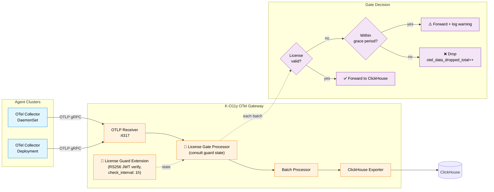

<div align="center">


# K-O11y OTel Gateway

**OpenTelemetry Collector distribution with JWT-based license validation for enterprise.**

[English](README.md) | [한국어](README.ko.md)

[](https://www.repostatus.org/#wip)
[](LICENSE)
[](https://go.dev/)

Based on [OpenTelemetry Collector v0.109.0](https://github.com/open-telemetry/opentelemetry-collector).

</div>

---

## ✨ Features

- 🛂 **License Guard Extension** — RS256 JWT-based license validation (public key only — no private key required)
- 🚪 **License Gate Processor** — Drops telemetry (traces, logs, metrics) when the license has expired beyond the grace period
- ⏳ **Grace Period** — Configurable window (default 7 days) to warn operators without disrupting data flow immediately after expiration
- 🔁 **Periodic Re-validation** — License status re-checked on a configurable interval (default 1 hour)
- 📊 **Prometheus Metrics** — 4 built-in metrics for license health and drop accounting
- 🔧 **Pass-through Mode** — Works transparently without a license for dev/test environments
- 🏢 **Multi-tenant Aware** — License claims (`tenant_id`, `contract_id`) surfaced as metric attributes
- 📦 **Upstream compatible** — Full OTel Collector features (ClickHouse exporter, span metrics processor, etc.) retained

---

## 🏗️ How It Works

The gateway sits at the edge of the Host cluster, in front of ClickHouse. Every OTLP payload from Agent clusters passes through a two-stage license check: the **License Guard Extension** holds and refreshes the current license state, and the **License Gate Processor** consults that state on each batch, either forwarding to ClickHouse or dropping with a counter increment.



**Validation flow**:

1. On startup, License Guard loads the JWT from env (`LICENSE_KEY`) and verifies the RS256 signature with the configured public key
2. Guard extracts claims (`tenant_id`, `contract_id`, `exp`) and records them on Prometheus metrics
3. Every `check_interval` (default 1h), Guard re-validates and updates its in-memory status
4. For every telemetry batch, License Gate Processor consults Guard's status:
   - **Valid** → forward to the next processor
   - **Expired but within grace period** → forward + log a warning
   - **Expired beyond grace period** → drop and increment `otel_data_dropped_total`

---

## 🧩 Custom Components

### License Guard Extension

A JWT-based license validation extension that exposes license status via Prometheus metrics and OpenTelemetry internal metrics.

- **RS256 public-key verification** — only the public key is deployed to the gateway; private keys stay with the license issuer
- **Expiration tracking** with configurable grace period
- **Periodic re-validation** (default: `1h`)
- **Pass-through mode** when no license is configured (dev/test)
- **`fail_mode`** — `closed` to block on verification failure, `open` to allow

### License Gate Processor

A processor that drops telemetry data when the License Guard reports an expired license beyond the grace period.

- Works with **traces, logs, and metrics** pipelines
- Integrates with License Guard Extension by name (`extension_name`)
- **In grace period**: warns but lets data through
- **After grace period**: drops data and increments `otel_data_dropped_total`

---

## ⚙️ Configuration

### License Guard Extension

```yaml
extensions:
  license_guard:
    # JWT license key (environment variable reference)
    license_key_env: "LICENSE_KEY"

    # RSA public key for JWT verification (PEM format)
    public_key_pem: |
      -----BEGIN PUBLIC KEY-----
      ...
      -----END PUBLIC KEY-----

    # Re-validation interval (default: 1h)
    check_interval: 1h

    # Grace period after expiration (default: 7 days)
    grace_period_days: 7

    # Behavior on validation failure: "closed" (block) or "open" (allow)
    fail_mode: closed
```

### License Gate Processor

```yaml
processors:
  license_gate:
    # Name of the License Guard extension to check (default: "license_guard")
    extension_name: license_guard
```

### Pipeline Example

```yaml
extensions:
  license_guard:
    license_key_env: "LICENSE_KEY"
    public_key_pem: |
      -----BEGIN PUBLIC KEY-----
      ...
      -----END PUBLIC KEY-----

service:
  extensions: [license_guard]
  pipelines:
    traces:
      receivers: [otlp]
      processors: [license_gate, batch]
      exporters: [clickhouse]
    logs:
      receivers: [otlp]
      processors: [license_gate, batch]
      exporters: [clickhouse]
    metrics:
      receivers: [otlp]
      processors: [license_gate, batch]
      exporters: [clickhouse]
```

---

## 🛠️ Build

### Prerequisites

- Go 1.22+
- Docker

### Binary Build

```bash
go build -o signoz-otel-collector ./cmd/signozotelcollector
```

### Docker Image Build

```bash
docker build -t ghcr.io/wondermove-inc/signoz-otel-collector:latest \
  -f cmd/signozotelcollector/Dockerfile .
```

### Run Tests

```bash
go test ./extension/licenseguardextension/...
go test ./processor/licensegateprocessor/...
```

---

## 📊 Prometheus Metrics

| Metric | Type | Description | Attributes |
|--------|------|-------------|------------|
| `otel_license_valid` | Gauge | Whether the license is currently valid (`1`=valid, `0`=invalid) | `tenant_id`, `contract_id` |
| `otel_license_expires_in_days` | Gauge | Days until license expiration (negative = expired) | `tenant_id`, `contract_id` |
| `otel_grace_period_remaining_days` | Gauge | Days remaining in grace period (`0` if not in grace period) | `tenant_id`, `contract_id` |
| `otel_data_dropped_total` | Counter | Total data points dropped due to license expiration | `reason=license_expired`, `signal=traces\|logs\|metrics` |

**Example alert rules**:

```yaml
# License expiring within 14 days
- alert: LicenseExpiringSoon
  expr: otel_license_expires_in_days < 14
  for: 10m

# Data being dropped due to expired license
- alert: DataDroppedLicenseExpired
  expr: rate(otel_data_dropped_total[5m]) > 0
  for: 1m
```

---

## 🐛 Troubleshooting

| Symptom | Likely Cause | Fix |
|---------|--------------|-----|
| `license_guard: failed to verify JWT` on startup | Public key PEM mismatch or wrong `LICENSE_KEY` env | Verify `public_key_pem` matches the issuer's key pair; re-check `LICENSE_KEY` value |
| `otel_license_valid = 0` but license is new | Clock skew on the gateway host | Ensure NTP is configured on the gateway node |
| `otel_data_dropped_total` increasing unexpectedly | License expired and grace period ended | Rotate the license key (`LICENSE_KEY` env) and restart, or increase `grace_period_days` temporarily |
| Gateway starts but no data reaches ClickHouse | `license_gate` processor ordering | Confirm `license_gate` is before `batch` in every pipeline |
| Dev environment blocked by license | Production config applied to dev | Omit the `license_guard` extension entirely for pass-through mode |

---

## 🤝 Contributing

K-O11y OTel Gateway is part of the broader [K-O11y](https://github.com/Wondermove-Inc/k-o11y) project.

1. **Find an issue** labeled `good first issue` or `help wanted`
2. **Comment on the issue** to claim it (avoid duplicate work)
3. **Fork, branch, and send a PR** — scope narrowly, describe clearly
4. **Address review feedback** — maintainers will reply within a few days

See [CONTRIBUTING.md](CONTRIBUTING.md) for details.

This project follows **passive maintenance** — PRs and issues are reviewed as time allows. We aim to respond within 7 days but cannot guarantee faster turnaround.

---

## 📄 License

Apache License 2.0 — see [LICENSE](LICENSE).

Forked from [SigNoz OTel Collector](https://github.com/SigNoz/signoz-otel-collector) (Apache 2.0), based on the [OpenTelemetry Collector](https://github.com/open-telemetry/opentelemetry-collector) (Apache 2.0). See [NOTICE](NOTICE) for attribution details.

---

## 🔗 Related

- **Umbrella**: [k-o11y](https://github.com/Wondermove-Inc/k-o11y) — meta-repo with the full stack overview
- **Server**: [k-o11y-server](https://github.com/Wondermove-Inc/k-o11y-server) — Observability backend + Core API
- **Install**: [k-o11y-install](https://github.com/Wondermove-Inc/k-o11y-install) — Helm charts + Go CLI installers
- **OTel Collector**: [k-o11y-otel-collector](https://github.com/Wondermove-Inc/k-o11y-otel-collector) — Agent-side collector with CRD Processor

---

## 💬 Contact

- 🐛 **Bug reports & feature requests**: [GitHub Issues](https://github.com/Wondermove-Inc/k-o11y-otel-gateway/issues)
- 💭 **Questions & discussions**: Open an issue on the [umbrella repo](https://github.com/Wondermove-Inc/k-o11y/issues)
- 🌐 **Website**: [www.skuberplus.com](https://www.skuberplus.com)

---

<div align="center">

**Built and maintained by [Wondermove](https://www.skuberplus.com)**

</div>
